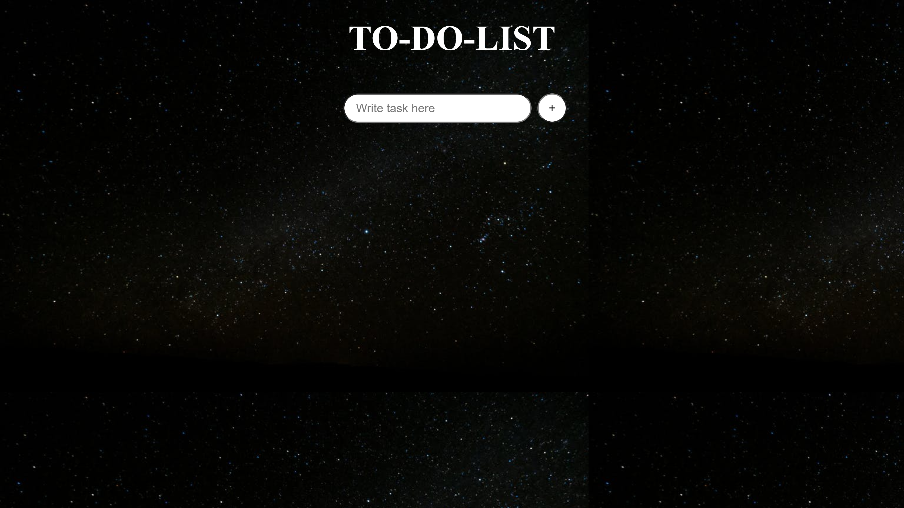
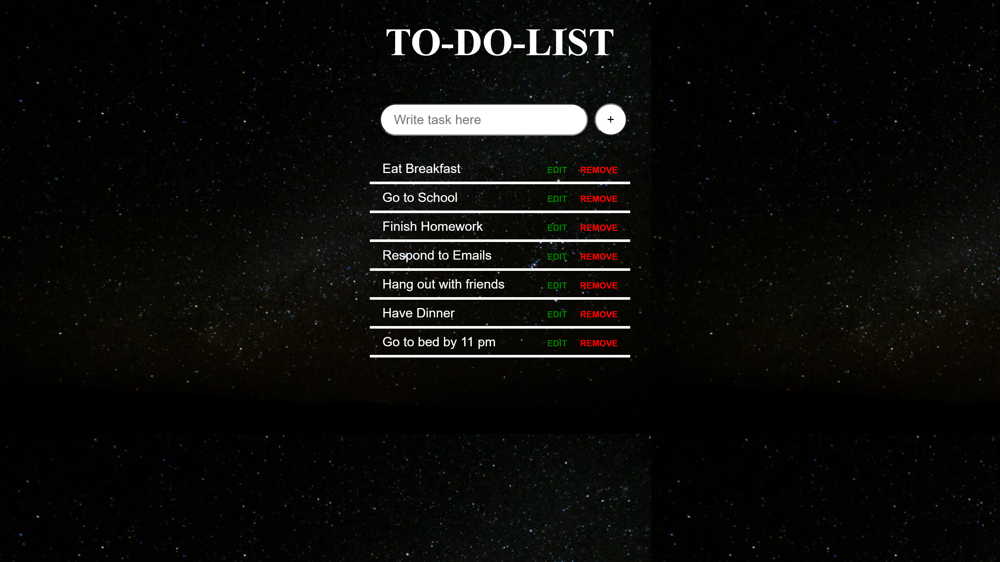
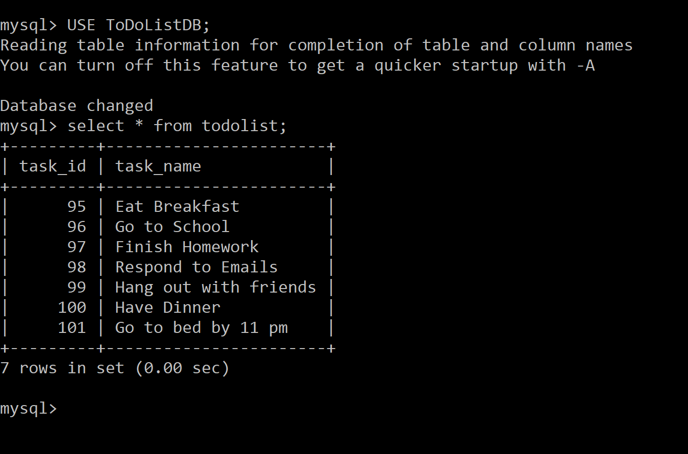

# To-Do-List
## This is a To-Do-List web application to add, edit and delete tasks. The application stores and retrieves data from a database. The project uses Node.js and MySQL.

This is the basic layout of the project.

Task additions can be made by using the plus button. Tasks can be removed by using remove button and edited by using edit button.

Any changes made in application is saved in the MySQL database.
